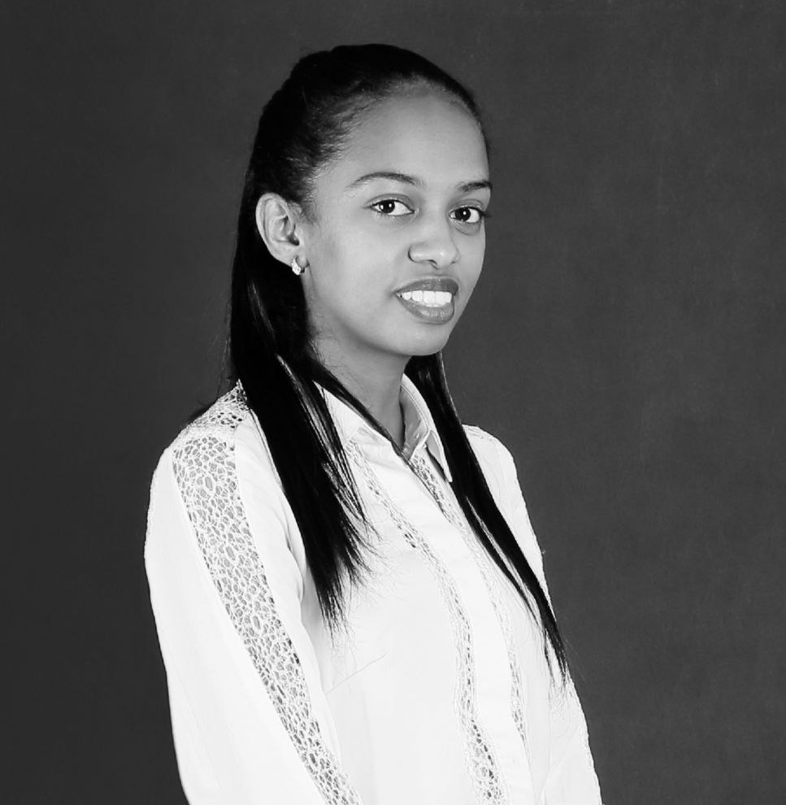

## Yamlak Asrat Bogale

 

I am currently pursuing an Advanced Master's degree in Electrical and Computer Engineering at Carnegie Mellon University, where my specialization is Applied Machine Learning. I've been actively involved in hands-on projects in this exciting field.  While my background is rooted in the computer software industry, my recent shift towards data analysis and applied machine learning reflects my passion for these areas. I am strongly interested in AI's applications in healthcare, language technologies, and the environment. 

I am now taking a short course at [ESIIL](https://esiil.org).

---

#### Contact Information
* [Email](yamlakyam@gmail.com)
* [LinkedIn](https://www.linkedin.com/in/yamlak-asrat-023467194/)
* [GitHub](https://github.com/yamlakyam)
* [Twitter](https://twitter.com/Yamlak_A_Bogale)

## 🤖Projects

| **Malaria Diagnosis Digitization**   _Intelligent Malaria Detection and Species classification_   This project leverages the power of deep learning to identify malaria parasites from images of blood samples collected from a biomedical center and also classify the species of the parasites. Close collaboration with experts from a biomedical lab to annotate and label images. |  |
|:---|:---:|
| **Training a Speech Recognizer from Synthetic Data**   _Training speech recognizer with synthetic data, getting a closer performance of models using natural speech, minimizing the need for costly annotated data_    Utilized the VITS system, an end-to-end text-to-speech generator that uses a conditional Variational autoencoder (VAE) to connect two text-to-speech (TTS) modules and achieve high-quality speech waveforms. The goal is to reduce the need for expensive annotated speech data and achieve performance comparable to natural speech. Its practical application lies in automatic speech recognition for languages with limited resources. |  |
| **Predicting PM2.5 Levels in Pretoria, South Africa Using Air Quality and Remote Sensing Data: A Comparative Analysis of Machine Learning Models**   _Utilized Sentinel satellite data and geospatial techniques to predict air quality in South Africa using machine learning models._   Considered major pollutants such as PM2.5, PM10, SO2, and CO. | |
| **Ethiopian Sign Language to Speech Conversion**   _Converts Ethiopian Sign Language to speech using glove-attached sensors, classification algorithm, and customized Android app. Aims marginalized community._   The project involved hardware interfacing, training classification algorithms, and mobile application development. | |

---

## 🎓 Educational Background

**Advanced MS. in Electrical and Computer Engineering / Applied Machine Learning**

_Carnegie Mellon University_ (May 2024)

**BSc. in Electrical and Computer Engineering / Computer Stream** 

_Addis Ababa University_ (Dec 2020)

---

## 💼 Experience

**Research Assistant in AI for Medical Imaging Analysis**  
_Cylab Africa / Upanzi Network_  
_Jun 2023 - Present_

Conducted malaria screening and species multi-classification research projects for precise diagnosis and identification. 

**Project Coordinator** 
_CarLovers LLC_ 
_Mar 2022 - Aug 2022_

Coordinated a software technology startup across Web, Android, and iOS platforms and monitored the project’s progress. Implemented Agile/Scrum methodology to facilitate the project’s smooth and efficient progression.

**Programmer**
_OM Consulting and Engineering_
_Jan 2022 - July 2022_

Developed map-based multi-purpose web apps for international clients using open layers and react-js. Prepared technical specification documents for bidding the company participated in.

**Developer**          
_CNET Software Technologies_
_Mar 2021- Feb 2022_

Created data-driven display apps for a multinational FMCG company utilizing real-time data of an ERP database, providing summary analytics based on sales, category, and date. Integrated with Google Maps to show details of sales locations. Utilized data analysis techniques and interactive visualizations to build visually intuitive and animated dashboards, and implemented tools to extract insights from the data using frameworks like SQL, Android, and .NET CORE.

---

## 🏅 Awards, Scholarships and Grants

- **Mastercard Foundation Scholar, Aug 2022 - Aug 2024,** awarded by Mastercard Foundation that covers full tuition fees.

- **Travel Grant, November 2023,** awarded by Cylab Africa/ Upanzi Network to attend and present a poster at the 2nd West African Conference West Africa Conference on Digital Public Goods and Cybersecurity.

- **ICLR Registration Grant, May 2023,** awarded by Women in Machine Learning to attend the International Conference on Learning Representation held in Kigali, Rwanda.

- **Travel Grant, July 2023,** awarded by Carnegie Mellon University Africa to attend the 19th South American Business Forum held in Buenos Aires, Argentina.

- **Google African Developers Award, February 2022,** awarded by Google Africa in partnership with Andela and Pluralsight to receive a scholarship that gives access to a learning platform and projects. I was selected to take the Associate Android Developer Track.

- **#HACK2021 People's Choice, December 2021** awarded by Indigitous for building a mobile application that helps youth connect with their spiritual life for a hackathon.

- **Very Great Distinction, December 2020,** awarded by the School of Electrical and Computer Engineering at Addis Ababa University 

---
